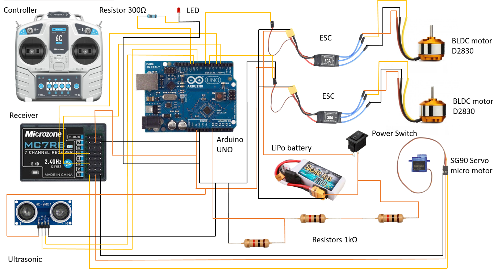
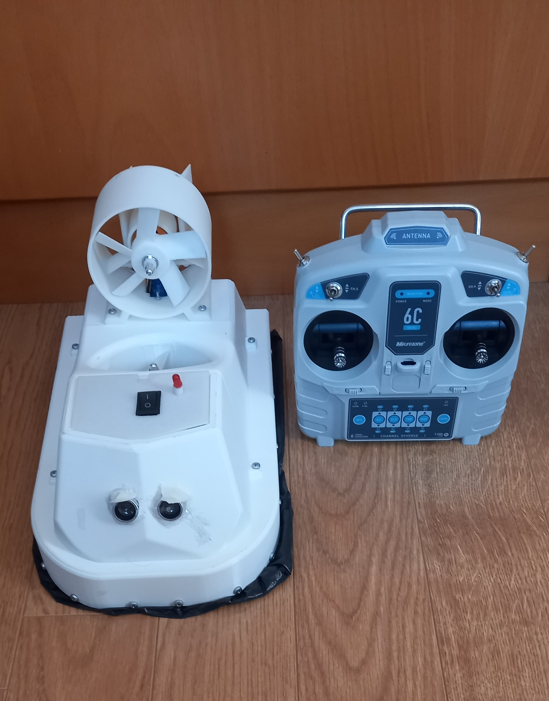

# DIY Hovercraft Control Code

This repository contains the Arduino code used in my DIY hovercraft project.
The system controls two brushless motors (lift and thrust) through ESCs, integrates an ultrasonic sensor for obstacle detection, and monitors battery voltage for safe operation.

## Features
- Brushless motor control using ESCs
- Ultrasonic distance sensing for obstacle avoidance
- PWM mapping from RC receiver signals
- Battery voltage monitoring with LED warning

## Hardware
- Arduino Uno
- 2× D2830 Brushless DC Motors + ESCs 30A
- SG90 Servo Micro Motor
- HC‑SR04 Ultrasonic Sensor
- RC Receiver, 6C, 2.4GHz
- RC Controller, 6C, 2.4GHz
- 3S LiPo Battery 11,1V
- LED indicator
- Power Switch
- Resistors

## Circuit Diagram

## Hovercraft Prototype

## How to Use
1. Open `Hovercraft_Arduino_Code.ino` in Arduino IDE
2. Upload the code to Arduino UNO
3. Connect components as shown in the circuit diagram
